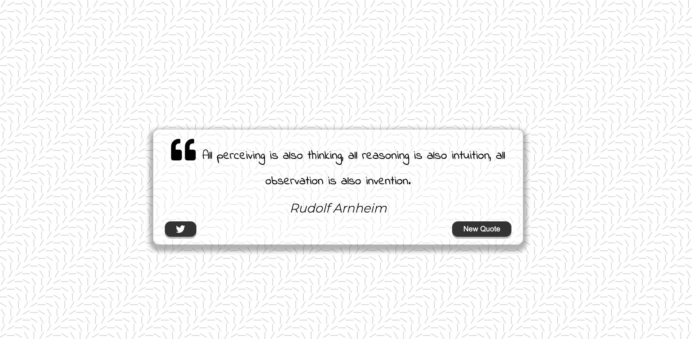

# Read Me Template



> This is a ReadMe template to help save you time and effort.

---

### Table of Contents
You're sections headers will be used to reference location of destination.

- [Description](#description)
- [How To Use](#how-to-use)
- [References](#references)
- [License](#license)
- [Author Info](#author-info)

---

## Description

This is a quote generator that fetches quotes and quotes' authors from Forismatic's API.

#### Technologies

- javascript
- html5
- css3

[Back To The Top](#read-me-template)

---

## How To Use
Fairly simple to use.
A tweet button for tweeting the given quote.
New Quote button for generating a new quote.

#### Installation

gh repo clone jaaska-dev/quote-generator 
or 
git clone https://github.com/jaaska-dev/quote-generator.git

Run a live server on index.html

#### API Reference

```html
     http://forismatic.com/en/api/ 
```
[Back To The Top](#read-me-template)

---

## Author Info

- Twitter - [@jaaskakarl](https://twitter.com/jaaskakarl)

[Back To The Top](#read-me-template)
